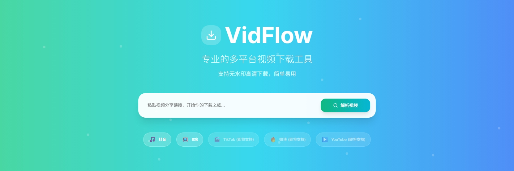
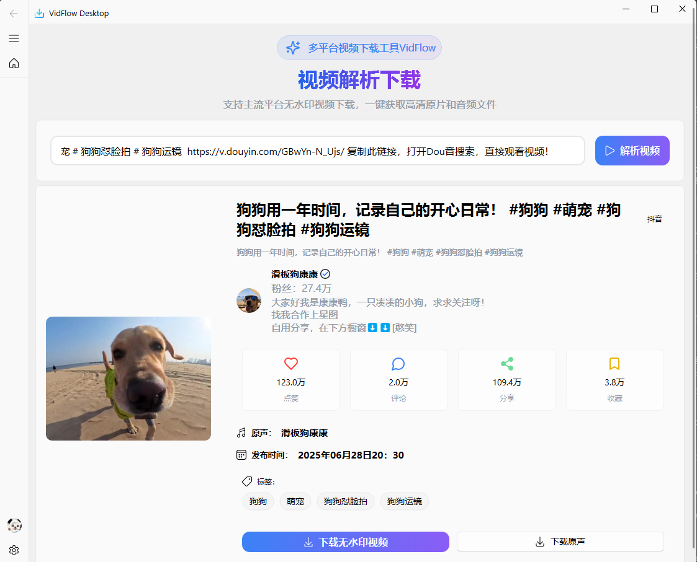

<div align="center">
  
</div>

<div align="center">
  
  
  
  
  
</div>

<h1 align="center">
  VidFlow Desktop
</h1>
<p align="center">
  一个基于 PyQt5 和 QFluentWidgets 的现代化多平台视频下载工具，支持抖音、B站等主流视频平台的高质量视频下载。
</p>

## 功能介绍

- 🎯 **多平台支持** - 支持抖音、B站等主流视频平台
- 🎨 **现代化界面** - 基于 QFluentWidgets 设计语言的美观界面
- 📱 **多质量选择** - 支持多种视频质量和格式选择
- 🔐 **B站登录** - 支持B站账号登录，下载更高质量视频
- 📊 **实时进度** - 实时显示下载进度和状态
- 🌙 **主题切换** - 支持明暗主题切换
- 💾 **系统托盘** - 支持最小化到系统托盘
- 🎵 **音频提取** - 支持单独下载音频文件

## 🚀 已实现功能

### 视频下载
- ✅ **抖音单视频下载** - 支持抖音短视频的高质量下载
- ✅ **B站单视频下载** - 支持B站视频的多质量下载
- ✅ **音频下载** - 支持从视频中提取并下载原声音频

### 用户体验
- ✅ **视频信息解析** - 自动获取视频标题、时长、封面等信息
- ✅ **质量选择对话框** - 直观的视频质量选择界面
- ✅ **下载进度显示** - 实时显示下载进度和状态
- ✅ **系统设置** - 完整的应用设置和配置选项

### 平台集成
- ✅ **B站账号登录** - 支持扫码登录B站账号
- ✅ **多格式支持** - 支持MP4、FLV等多种视频格式
- ✅ **自动重试机制** - 下载失败时自动重试

## 🔮 未来规划

### 平台扩展
- 🔄 **YouTube支持** - 计划集成YouTube视频下载功能
- 🔄 **微博视频** - 支持微博平台的视频下载
- 🔄 **更多平台** - 逐步支持更多主流视频平台

### 功能增强
- 🔄 **批量下载** - 支持多个视频同时下载
- 🔄 **播放列表下载** - 支持整个播放列表的批量下载
- 🔄 **B站番剧下载** - 支持B站番剧和电视剧的批量下载
- 🔄 **下载队列管理** - 更强大的下载任务管理功能

### 用户体验优化
- 🔄 **下载历史记录** - 记录和管理下载历史
- 🔄 **自定义下载路径** - 支持为不同平台设置不同的下载目录
- 🔄 **视频预览** - 下载前预览视频内容
- 🔄 **字幕下载** - 支持下载视频字幕文件

## 🖼️ 界面预览

<div align="center">
  
</div>

## 🚀 快速开始

### 环境要求

- Python 3.12 或更高版本
- Windows 10/11, macOS 10.14+, 或 Linux

### 安装步骤

1. **克隆仓库**
   ```bash
   git clone https://github.com/markcxx/VidFlowDesktop.git
   cd VidFlowDesktop
   ```

2. **安装依赖**
   ```bash
   pip install -r requirements.txt
   ```

3. **运行应用**
   ```bash
   python VidFlowDesktop.py
   ```

## 📖 使用说明

1. **获取视频信息**
   - 在输入框中粘贴视频链接
   - 点击"获取视频信息"按钮
   - 等待解析完成

2. **选择下载质量**
   - 点击"下载视频"按钮
   - 在弹出的对话框中选择所需的视频质量
   - 确认下载

3. **B站视频下载**
   - 对于B站视频，建议先登录账号以获取更高质量的视频
   - 在设置页面进行B站账号登录

## 🛠️ 技术栈

- **界面框架**: PyQt5
- **设计语言**: Fluent (qfluentwidgets)
- **网络请求**: requests, aiohttp
- **图像处理**: Pillow
- **二维码生成**: qrcode
- **异步处理**: aiofiles

## 📁 项目结构

```
VidFlowDesktop/
├── app/
│   ├── common/          # 公共模块
│   ├── components/      # UI组件
│   ├── view/           # 界面视图
│   └── resource/       # 资源文件
├── VidFlowDesktop.py   # 主程序入口
├── requirements.txt    # 依赖列表
└── README.md          # 项目说明
```

## 🤝 贡献

欢迎提交 Issue 和 Pull Request！

## 📄 许可证

本项目采用 MIT 许可证 - 查看 [LICENSE](LICENSE) 文件了解详情。

## ⚠️ 免责声明

本工具仅供学习和研究使用，请遵守相关平台的服务条款和版权法律法规。用户应对使用本工具产生的任何后果承担责任。
版权所有 © 2025 mark.

## 📞 联系方式

如有问题或建议，请通过以下方式联系：

- 📧 Email: 2811016860@qq.com
- 🐛 Issues: [GitHub Issues](https://github.com/markcxx/VidFlowDesktop/issues)

---

<div align="center">
  <sub>Built with ❤️ by mark</sub>
</div>